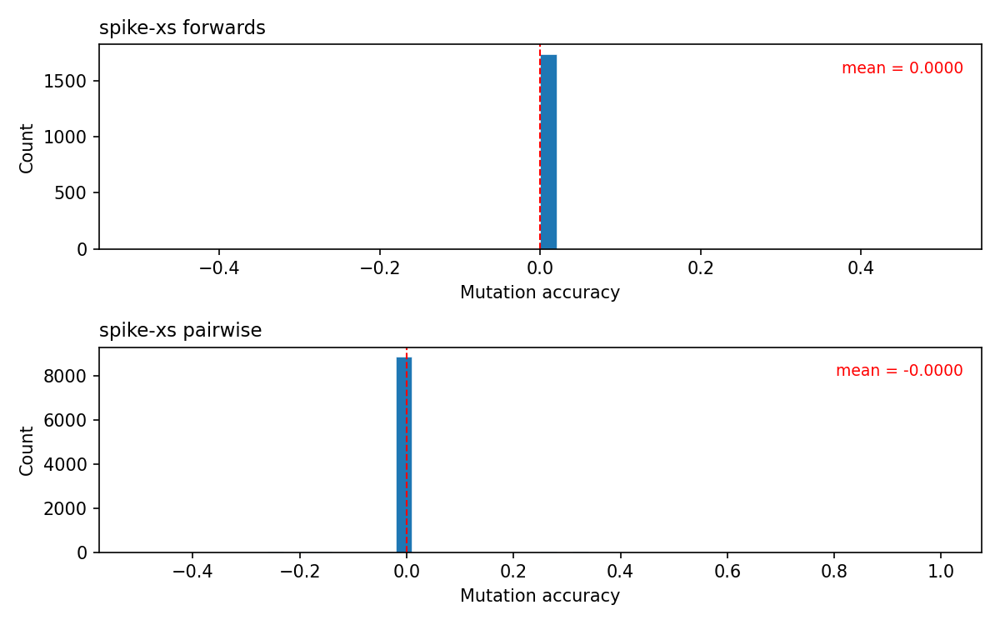

# Baseline evaluation

Random-mutation baseline predictor for sequence trajectory prediction. This document describes the evaluation protocol in enough detail to implement evaluation for any model.

## The prediction task

Given a **source sequence** and the number of mutations **N** that occurred between source and target, predict the **target sequence**. The model knows the source sequence and N, but not which positions changed or what they changed to.

There are two trajectory types, each defining source-target pairs differently:

### Forwards trajectories (root-to-tip)

A forwards trajectory FASTA contains a root-to-tip path through a phylogenetic tree. Each entry is a node along the path:

```
>X|0
ATCGATCGAT
>Y|1
ATCAATCGAT
>A|2
ATCAAGCAAT
```

The header format is `>{node_name}|{N}` where N is the number of ACGT mutations from the **previous entry** in the file (0 for the root). This produces **consecutive source-target pairs**:

| Source | Target | N |
|---|---|---|
| X (sequence `ATCGATCGAT`) | Y (sequence `ATCAATCGAT`) | 1 (from Y's header) |
| Y (sequence `ATCAATCGAT`) | A (sequence `ATCAAGCAAT`) | 2 (from A's header) |

A trajectory with K entries yields K-1 prediction tasks. Each pair is an independent single-step prediction: given the source sequence and N, predict the target sequence.

### Pairwise trajectories (tip-to-tip)

A pairwise trajectory FASTA contains exactly two tip sequences:

```
>A|0
ATCAAGCAAT
>B|3
ATCAATCGGT
```

The first tip always has `|0`. The second tip has `|N` where N is the ACGT Hamming distance between the two sequences. This produces **one prediction task**: given A's sequence and N=3, predict B's sequence.

## The metric: mutation accuracy

For a source-target pair with N true mutations:

1. **Truth set**: the set of positions where source and target differ (both must be ACGT, positions with gaps `-` or ambiguous bases `N` are excluded). This has size N.
2. **Predicted set**: the set of positions where the prediction differs from source (both ACGT). This has size M.
3. **Correct**: number of positions that appear in both sets with the matching nucleotide (same position, same base as target).

```
mutation_accuracy = (correct - |M - N|) / N
```

The `|M - N|` term penalizes miscalibration — predicting too many or too few mutations costs the same per mutation. When M = N, this reduces to the fraction of correct mutations.

**Score interpretation**:
- 1.0 = perfect prediction (all N mutations correctly identified)
- 0.0 = correct mutation count but all at wrong positions or wrong nucleotides
- Near 0 = random baseline (expected value ≈ N / 3L for random flips)
- -1.0 = copy source unchanged (zero predicted mutations)

Pairs with N = 0 (identical source and target) are excluded from accuracy computation.

See `notes/mutation_accuracy_metric.md` for worked examples.

## What the baseline does

For each source-target pair, the baseline:

1. Reads N (mutation count) from the FASTA header
2. Flips N random ACGT positions in the source to a uniformly random different nucleotide (Jukes-Cantor model: each of the 3 alternatives equally likely)
3. Scores the single prediction against the target using mutation accuracy

One prediction per pair, no averaging. With thousands of pairs per dataset, the aggregate statistics are stable. This establishes a lower bound: any useful model should score above the random baseline.

## Porting to a real model

To evaluate a model, iterate over test shard trajectories and score predictions against the held-out targets. The evaluation loop is:

```python
for filename, content in iter_fasta_from_shards(shard_paths):
    frames = parse_fasta_frames(content)
    # frames = [(node_name, N, sequence), ...]

    if trajectory_type == "forwards":
        # Consecutive pairs: (frame[0], frame[1]), (frame[1], frame[2]), ...
        for i in range(len(frames) - 1):
            source_seq = frames[i][2]
            target_seq = frames[i + 1][2]
            N = frames[i + 1][1]  # header token of the target frame
            predicted_seq = model.predict(source_seq, N)
            score = mutation_accuracy(source_seq, target_seq, predicted_seq)

    elif trajectory_type == "pairwise":
        # Single pair: frame[0] is source, frame[1] is target
        source_seq = frames[0][2]
        target_seq = frames[1][2]
        N = frames[1][1]  # header token of the second frame
        predicted_seq = model.predict(source_seq, N)
        score = mutation_accuracy(source_seq, target_seq, predicted_seq)
```

Where `mutation_accuracy` computes:

```python
def mutation_accuracy(source, target, predicted):
    """Score a predicted sequence against the true target.

    All three sequences must be the same length. Positions where source
    or target contain gaps (-) or N are excluded from all counts.
    """
    VALID = set("ACGT")
    correct = 0
    M = 0  # predicted mutations
    N = 0  # true mutations

    for s, t, p in zip(source, target, predicted):
        if s not in VALID or t not in VALID:
            continue
        if s != t:
            N += 1
            if p == t:
                correct += 1
        if p in VALID and p != s:
            M += 1

    if N == 0:
        return float("nan")
    return (correct - abs(M - N)) / N
```

Key details:
- The model receives the **source sequence** and **N** (mutation count) as input
- The model must return a sequence of the same length as the source
- Positions with gaps or N in source or target are excluded from scoring
- The model should aim to predict exactly which N positions changed and to what nucleotide

## Output format

The evaluation writes a TSV with one row per source-target pair:

| Column | Description |
|---|---|
| `dataset` | Dataset name (e.g. `spike-xs`) |
| `trajectory` | Trajectory filename stem |
| `source_node` | Source node name |
| `target_node` | Target node name |
| `N` | True mutation count (source vs target, ACGT positions only) |
| `L` | Number of positions where both source and target are ACGT |
| `M` | Predicted mutation count (source vs prediction, ACGT positions only) |
| `D` | Hamming distance between prediction and target (ACGT positions only) |
| `mutation_accuracy` | `(correct - \|M - N\|) / N`, or `NA` if N=0 |

## Usage

```bash
cd baseline
snakemake --cores 1 -p
```

By default this runs on `spike-xs` and `cytb-xs`. To target other datasets:

```bash
snakemake --cores 1 -p --config target_analyses='["spike-sm"]'
```

## Results



Distribution of per-prediction mutation accuracy for the spike-xs dataset. The random baseline scores near zero on both forwards (mean = 0.0002) and pairwise (mean = 0.0005) trajectories, as expected.
