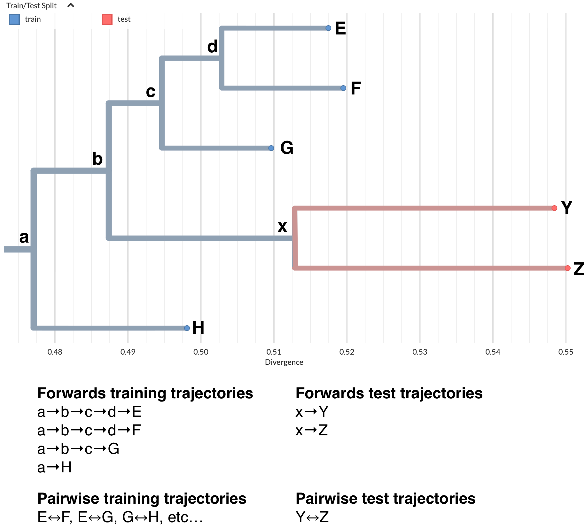

# Train/Test Split for Phylogenetic Trajectories

## Motivation

A trajectory represents the evolutionary path from the root of a phylogenetic tree to a specific tip (sampled sequence). Because trajectories share common ancestors, individual trajectories largely overlap. Simply splitting trajectories randomly into train and test sets would not create truly independent test data, as the model would have seen most of the evolutionary history during training.

To create meaningful out-of-sample test data, we mark entire clades as "test". This ensures test trajectories represent complete evolutionary lineages that branch off from the training data at a defined point.

## Clade Selection Algorithm

1. **Select a seed tip** randomly from unmarked tips
2. **Walk back toward root**, counting mutations on each branch
3. **Find the clade root**: When accumulated mutations >= `mutations_back`, use that ancestor as the clade root
4. **Check clade size**: If the clade contains > `max_clade_proportion` of total tips, skip this seed and try another (prevents selecting very large clades)
5. **Mark descendants**: Label all descendants of the clade root as "test"
6. **Repeat** until target `test_proportion` of tips are marked

Key parameters:
- `test_proportion`: Target fraction of tips to mark as test (default: 0.1)
- `mutations_back`: How far back from seed tip to place clade root (default: 5)
- `max_clade_proportion`: Maximum allowed size for any single test clade (default: 0.01)

## Trajectory Construction

Once nodes are labeled, trajectories are constructed differently for train vs test tips:



**Training trajectories** follow the full path from root to tip:
- `a→b→c→d→E`
- `a→b→c→d→F`
- `a→b→c→G`
- `a→H`

**Test trajectories** are truncated to start at the test clade boundary (first test node):
- `x→Y`
- `x→Z`

This truncation is critical: if test trajectories included the full root-to-tip path, the model would be tested on evolutionary history it saw during training. By starting test trajectories at the clade boundary, we ensure the test data represents genuinely unseen evolutionary paths.

## Pairwise Trajectories

For models that predict trajectories between arbitrary sequence pairs (not just root-to-tip), the same principle applies:

**Training pairs**: Any pair of training tips (e.g., `E↔F`, `E↔G`, `G↔H`)

**Test pairs**: Pairs within test clades only (e.g., `Y↔Z`)

Cross-clade pairs between train and test tips are excluded to maintain separation. Each pairwise FASTA contains two sequences with their Hamming distance in the headers (`|0` for the first sequence, `|{distance}` for the second).

## Output Structure

The pipeline produces separate directories for forwards (root-to-tip) and pairwise (tip-to-tip) trajectories:

```
results/{analysis}/
├── forwards-train/
│   ├── tip1.fasta
│   ├── tip2.fasta
│   └── ...
├── forwards-test/
│   ├── tip3.fasta
│   └── ...
├── pairwise-train/
│   ├── tipA__tipB.fasta
│   └── ...
└── pairwise-test/
    ├── tipX__tipY.fasta
    └── ...
```

These are then packaged into separate shards:
- `forwards-train-000.tar.zst`, `forwards-train-001.tar.zst`, ...
- `forwards-test-000.tar.zst`, `forwards-test-001.tar.zst`, ...
- `pairwise-train-000.tar.zst`, `pairwise-train-001.tar.zst`, ...
- `pairwise-test-000.tar.zst`, `pairwise-test-001.tar.zst`, ...
